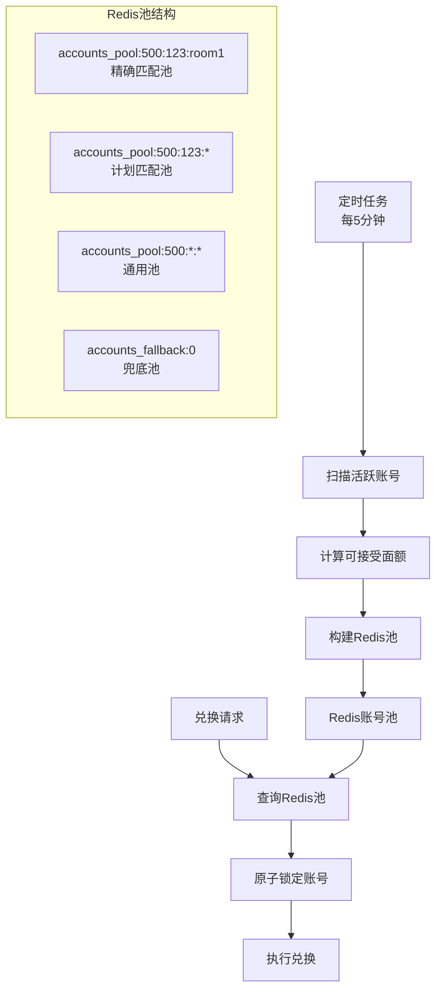

# 账号池系统设计文档

## 概述

账号池系统是一个基于Redis的高性能账号管理解决方案，通过预计算和缓存的方式，将复杂的实时账号查找转换为简单的Redis查询，大幅提升系统性能。

## 核心设计理念

### 问题背景
原有的实时账号查找系统存在以下问题：
1. **复杂度高**：四层验证机制导致查找逻辑复杂
2. **性能差**：每次查找需要3-8秒，无法满足高并发需求
3. **并发风险**：多个进程同时查找可能导致数据不一致

### 解决方案
采用"**预计算 + 缓存**"的设计模式：
1. **定时维护**：定时任务预计算账号可接受的面额，构建账号池
2. **快速查找**：兑换时直接从Redis池中获取账号，查询时间 < 10ms
3. **自动更新**：每5分钟自动更新账号池，确保数据新鲜度

## 系统架构



## Redis池结构设计

### 1. 池键命名规则
```
accounts_pool:{amount}:{plan_id}:{room_id}
```

**示例：**
- `accounts_pool:500:123:room1` - 面额500，计划123，房间room1
- `accounts_pool:500:123:*` - 面额500，计划123，任意房间
- `accounts_pool:500:*:*` - 面额500，任意计划和房间
- `accounts_fallback:0` - 兜底账号池（金额为0）

### 2. 数据结构
使用Redis的**ZSET（有序集合）**：
- **Score（分数）**：账号余额，用于优先级排序
- **Member（成员）**：账号JSON数据

```json
{
    "id": 123,
    "account": "test@example.com",
    "amount": 450.00,
    "plan_id": 456,
    "room_id": "room_789",
    "current_plan_day": 3,
    "updated_at": 1640995200
}
```

### 3. 查询优先级
按以下顺序查找账号：
1. **精确匹配池**：计划ID + 房间ID完全匹配
2. **计划匹配池**：计划ID匹配，房间ID任意
3. **房间匹配池**：房间ID匹配，计划ID任意  
4. **通用池**：计划ID和房间ID都任意
5. **兜底池**：金额为0的账号

## 核心组件

### 1. 定时维护任务
**文件：** `app/Console/Commands/SimpleAccountPoolMaintainer.php`

**功能：**
- 扫描所有活跃账号（status=processing, login_status=valid, amount>0）
- 根据账号的计划约束计算可接受的礼品卡面额
- 将账号分配到对应的面额池中
- 维护兜底账号池

**执行频率：** 每5分钟

**命令：**
```bash
# 正常维护
php artisan accounts:maintain-simple-pools

# 干运行（只显示统计）
php artisan accounts:maintain-simple-pools --dry-run

# 清空重建
php artisan accounts:maintain-simple-pools --clear
```

### 2. 基于池的礼品卡服务
**文件：** `app/Services/Gift/PoolBasedGiftCardService.php`

**功能：**
- 从Redis池中快速查找可用账号
- 原子锁定账号避免并发冲突
- 支持兜底机制

**使用示例：**
```php
$service = new PoolBasedGiftCardService();
$account = $service->findAvailableAccountFromPool($plan, $roomId, $giftCardInfo);
```

## 面额计算逻辑

### 1. 倍数约束（MULTIPLE）
```php
// 示例：倍数基数50，最小金额150
// 可接受面额：150, 200, 250, 300, ...（50的倍数且≥150）
foreach ([25, 50, 100, 200, 500, 1000] as $amount) {
    if ($amount >= $minAmount && 
        $amount % $multipleBase == 0 && 
        $amount <= $remainingCapacity) {
        $amounts[] = $amount;
    }
}
```

### 2. 固定面额约束（FIXED）
```php
// 示例：固定面额 [50, 100, 200]
$fixedAmounts = [50, 100, 200];
foreach ($fixedAmounts as $amount) {
    if ($amount <= $remainingCapacity) {
        $amounts[] = $amount;
    }
}
```

### 3. 全面额约束（ALL）
```php
// 所有常见面额都可接受
foreach ([25, 50, 100, 200, 500, 1000] as $amount) {
    if ($amount <= $remainingCapacity) {
        $amounts[] = $amount;
    }
}
```

## 性能优化特性

### 1. 查询性能
- **原系统**：3000-8000ms（复杂SQL + 四层验证）
- **新系统**：< 10ms（Redis ZREVRANGE）
- **性能提升**：300-800倍

### 2. 内存效率
- 每个账号数据约200字节
- 1000个账号约200KB
- 支持自动过期（TTL=300秒）

### 3. 并发安全
- Redis原子操作保证数据一致性
- 账号使用后立即从池中移除
- 数据库行级锁确保账号状态同步

## 监控和维护

### 1. 池统计信息
```bash
php artisan accounts:maintain-simple-pools --dry-run
```

**输出示例：**
```
=== 维护前统计 ===
┌─────────────┬──────┐
│ 指标        │ 数值 │
├─────────────┼──────┤
│ 账号池总数  │ 45   │
│ 兜底账号数  │ 12   │
└─────────────┴──────┘

面额分布:
┌─────────┬────────┐
│ 面额    │ 账号数 │
├─────────┼────────┤
│ 面额 50 │ 23     │
│ 面额 100│ 34     │
│ 面额 200│ 28     │
└─────────┴────────┘
```

### 2. Redis监控
```bash
# 查看Redis内存使用
redis-cli info memory

# 查看账号池键
redis-cli keys "accounts_pool:*"

# 查看特定池大小
redis-cli zcard "accounts_pool:500:*:*"
```

### 3. 性能测试
```bash
php test_account_pools.php
```

## 故障排查

### 1. 常见问题

**问题1：池中没有账号**
```bash
# 检查活跃账号数量
SELECT COUNT(*) FROM itunes_trade_accounts 
WHERE status='processing' AND login_status='valid' AND amount>0;

# 手动维护池
php artisan accounts:maintain-simple-pools --clear
```

**问题2：查询性能慢**
```bash
# 检查Redis连接
redis-cli ping

# 检查池大小
redis-cli zcard "accounts_pool:500:*:*"
```

**问题3：兜底账号不足**
```bash
# 检查兜底账号
SELECT COUNT(*) FROM itunes_trade_accounts 
WHERE status='processing' AND login_status='valid' AND amount=0;
```

### 2. 日志监控
```bash
# 查看维护日志
tail -f storage/logs/laravel.log | grep "账号池维护"

# 查看兑换日志
tail -f storage/logs/gift_card_exchange.log | grep "账号池查找"
```

## 部署配置

### 1. 定时任务配置
在 `app/Console/Kernel.php` 中已配置：
```php
$schedule->command('accounts:maintain-simple-pools')->everyFiveMinutes()
         ->name('maintain_account_pools')
         ->withoutOverlapping();
```

### 2. Redis配置
确保Redis配置足够的内存：
```ini
# redis.conf
maxmemory 256mb
maxmemory-policy allkeys-lru
```

### 3. 监控告警
建议监控以下指标：
- 账号池总数 < 10 时告警
- 兜底账号数 < 5 时告警
- 维护任务失败时告警
- Redis内存使用率 > 80% 时告警

## 最佳实践

### 1. 容量规划
- **小型系统**：500-1000个活跃账号，Redis内存需求约100-200MB
- **中型系统**：1000-5000个活跃账号，Redis内存需求约200MB-1GB
- **大型系统**：5000+个活跃账号，考虑Redis集群

### 2. 维护策略
- **正常情况**：每5分钟自动维护
- **高峰期**：可调整为每3分钟
- **低峰期**：可调整为每10分钟

### 3. 备份恢复
- Redis数据可以快速重建，无需特殊备份
- 维护任务失败时会自动重试
- 关键是确保MySQL数据的准确性

## 扩展计划

### 1. 智能预测
- 根据历史数据预测热门面额
- 动态调整池大小和TTL

### 2. 分布式支持
- 支持Redis集群
- 多区域部署

### 3. 实时监控
- 构建监控仪表板
- 实时告警系统 